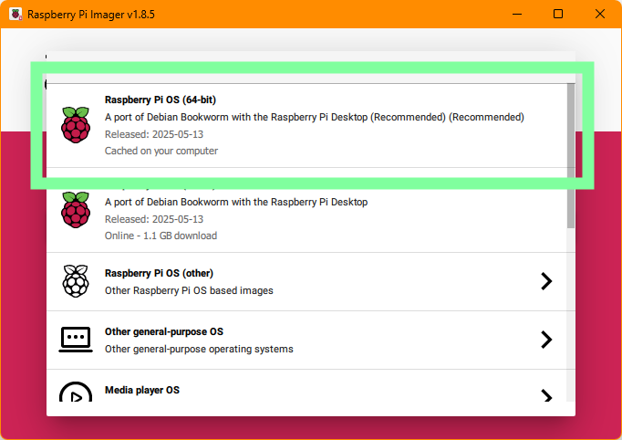

# Raspberry pi 5 headless SSD setup

Some time ago I bought a Raspberry Pi 5 kit with the Argon40 NEO V5 case, which is a case that has a built-in NVMe M.2 slot.
This means that instead of using a microSD for the OS, we can use an NVMe SSD as the boot drive.
In my mind, the setup for this should be like any other Raspberry Pi setup, just with an SSD instead of an SD card. Right?
Well, as it turns out, not exactly.

## What is a headless setup?

A headless setup is a setup where the Raspberry Pi is not connected to a monitor, keyboard, or mouse.
To access the Raspberry Pi, we will use SSH, Pi connect, or VNC to access the device.

## What you will need

- Raspberry Pi 5
- Argon40 NEO V5 case
- NVMe M.2 SSD (I used a 1TB Samsung 990 Pro)
- M.2 to USB adapter
- fast charge cable

Things you _might_ need:

- SD card
- ethernet cable
- micro HDMI cable

If all things go well, after writing the OS to the SSD the Raspberry Pi should be set up already.
Just in case things do not go well, however, it might be a good idea to have the optional items above ready.

## Writing the OS to the SSD

To write the OS to the SSD, we will use the Raspberry Pi Imager tool.

1. Download the [Raspberry Pi Imager](https://www.raspberrypi.com/software/) tool.
2. Under "Raspberry Pi Device" select "Raspberry Pi 5".
   
3. For "Operating System", select "Raspberry Pi OS (64-bit)".
   
4. For "Storage", select the NVMe SSD.
   
5. Click Next, and then click "Edit Settings"
   
6. Under "General", we have a few things to set up: - **Hostname**: Set a hostname for your pi. This name will be used to connect to the Pi later on. - **Enable SSH**: Check this box to enable SSH access. - **Username and Password**: Set a username and password for the Raspberry Pi. - **Configure wireless LAN**: If you do not plan to use an ethernet cable, make sure to set up your WiFi here. - **Set Locale Settings**: Set your locale settings if needed.
   
7. Under "Services", we configure the SSH settings: - **Enable SSH**: Check this box to enable SSH access. - **Allow password authentication**: Check this box to allow password authentication.
   
8. Under "Options", we can choose to disable telemetry.
   
9. Click "Save" to save the settings, and then click "Yes" to write the OS to the SSD.
   

Once the writing is complete, we are done! take out the SSD and mount it to the Argon40 NEO V5 case.

## Connecting to the Raspberry Pi

## Enabling remote desktop

### Via VNC

### Via Pi Connect

## Troubleshooting

### Cannot detect SSD/ booting into the wrong drive

1. argon 40 scripts
2. update bootloader
3. changing the boot order
4. check the SSD connection
5. check the power supply (use a fast charge cable)

### Wifi not Connecting

1. nmcli: https://askubuntu.com/questions/461825/how-to-connect-to-wifi-from-the-command-line/461831#461831
2. check connection: https://askubuntu.com/questions/138472/how-do-i-connect-to-a-wpa-wifi-network-using-the-command-line

### Failure to resolve hostname

1. Check if you booted the right drive
2. Bonjour (for windows)
3. hostname already in use
4. Symbols in password
