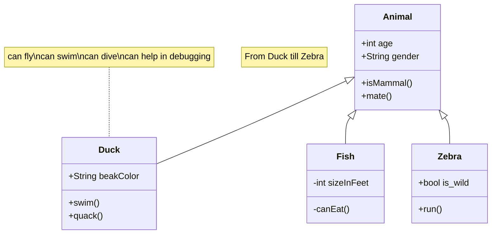

---

title: "Clean Architecture in Android"
description: "Applying clean architecture principles in Android development"
tags: ["android", "kotlin", "java"]
hidden: true

---

# Clean Architecture in Android

Recently, my team at OKX released the refactored version of our DeFi product details page. Let's discuss whats changed, and why we made those changes.

## Clean Architecture overview

