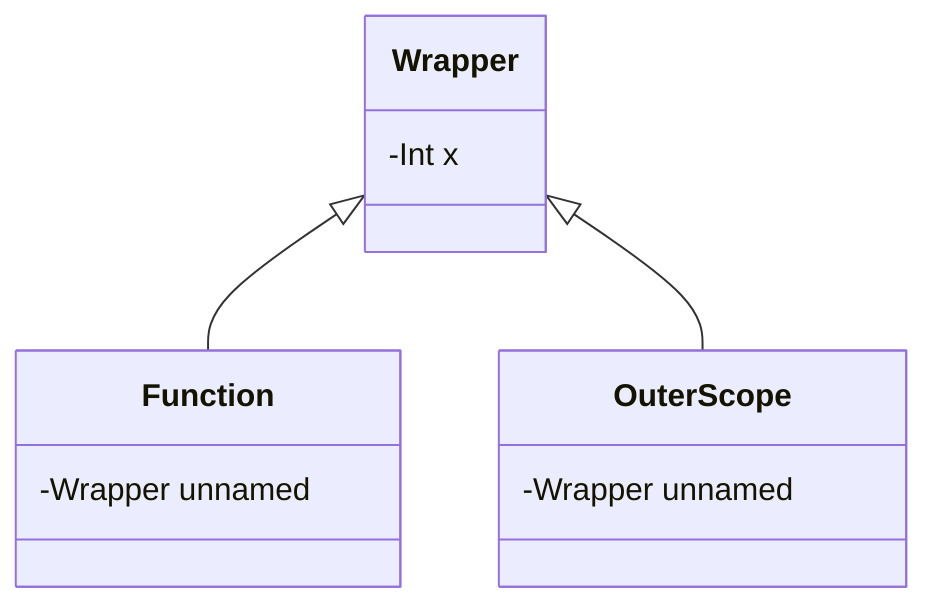

# Why are closures important?

Closures are a powerful concept in programming languages that allow functions to retain access to variables from their parent scope.

They allow us to make function arguments much more concise -- instead of passing in every argument to a function, the function can simply get the values from its parent scope.

Before diving into how it works, let's take a look at what it enables.

```javascript
// currying with closures
function makeAdder(x) {
    return function(y) {
        return x + y;
    };
}

// Immediately Invoked Function Expression (IIFE)
const printInaccessibleValue = (value) => {
    return () => console.log(value);
}(123);
printInaccessibleValue(); // 123
console.log(Object.keys(printInaccessibleValue)); // [] we cannot access value
```

## How do closures work?

Closures work by capturing the environment in which they are defined as a `context`. This means that even after the parent scope is supposedly
no longer accessible, the closure can still access the variables from the parent scope. This is not the same as maintaining a copy
of the parent scope -- the closure actually maintains a reference to the parent scope, including all variables, used and unused (**At least in theory -- see deep dive**).

```javascript
function makeCounter() {
  let count = 0;
  return [
    function getter() {
      return count;
    },
    function increment() {
      count++;
    },
  ];
}
const [getter, increment] = makeCounter();
```

In this example, after `makeCounter` has returned, the `count` variable should be inaccessible. However, we can still modify `count`
using `increment()`, and we can still read `count` using `getter()`.

### Deep dive: JavaScript

There is a comprehensive article on this topic [link](https://javascript.info/closure) this section is based on.

Every variable in JavaScript is actually a property of a special internal object the `LexicalEnvironment` (see: [ECMAscript](https://262.ecma-international.org/5.1/#sec-10.3)).
Suppose we declare a variable `x` in the global lexical environment.

```javascript
let x;
x = 'hello';
```

1. Initial: `phrase = <uninitialized>`, the variable is already in the environment record, but it is not yet initialized.
2. Declaration: `phrase = undefined`, the variable is now initialized, but it has no value.
3. Assignment: `phrase = "hello"`, the variable now has a value.

When a function is created, it captures the `environment record` of the parent scope. This environment record is stored in the function object itself, and is called the `[[Environment]]` property.
When we attempt to reference a variable in a function, it first searches the function's environment record. If the variable is not found, it searches the parent's environment record, and so on.

```javascript
let surname = 'Smith';
let name = 'Jane';
function sayHi() {
  let name = 'John';
  console.log(`Hello, ${name} ${surname}`);
}
sayHi(); // Hello, John Smith
```

#### Optimizations: V8 garbage collector

At this point, you might notice a potential memory leak. Suppose we have a function that captures a small variable from the parent scope. If the function is kept alive, the small variable cannot be
garbage collected. Further suppose there is also a large variable in the same scope, then in theory the large variable is also kept alive since the function retains the parent scope the large variable
is in. This is a potential memory leak.

```JavaScript
function f() {
  let hugeVar = new Array(1000).fill(0);
  let smallVar = 1;
  return function() {
    console.log(smallVar);
  };
}
```

In reality, many JavaScript engines analyze variable usage, and will remove the large variable if it is obvious the variable will not be used anymore.
**In particular, V8 engine (Chrome, Edge, Opera) does so, and outer variables will become unavailable in debugging.** Here's a neat example:

```javascript
let value = 'Surprise!';

function f() {
  let value = 'the closest value';

  function g() {
    debugger; // in console: type alert(value); Surprise!
  }

  return g;
}

let g = f();
g();
```

Interesting behaviour! Now what about non V8 engines? Are we able to emulate this behaviour, possibly with `delete` in non strict mode? (you cant attempt to unqualified names in strict mode)
The answer is no, which we will explore in a later article. If you are interested, you can read more about them:

1. [StackOverflow](https://stackoverflow.com/questions/1596782/how-can-i-unset-a-javascript-variable): named references are implicitly object properties, so why can't we delete them?
2. [Understanding Delete](http://perfectionkills.com/understanding-delete/): delete deep dive, and some interesting quirks of `eval`, gecko browsers etc.

### Deep dive: Kotlin

In contrast to languages like JS that capture the entire lexical environment, kotlin instead captures only the local variables themselves. If the local variable is mutable,
then the variable is autoboxed into a special reference type -- think `Wrapper<Data>` for a field of type `Data`. This means that **if the variable is reassigned, the closure will see the new value**.
Here's an example to illustrate:

```kotlin
val (a, b) = {
    var obj = dataC(10);
    Pair({println(obj.value)}, {obj = dataC(obj.value + 10)});
}();

a(); // 10
b();
a(); // 20
```

For class properties, the closure will capture the instance of the class itself. Similarly, if the property is reassigned an object, the closure will see the new object.
Note that other class properties that are not referenced by the closure is eligible for garbage collection, if it is no longer reachable.



### Deep dive: Java

In Java, closures have to be effectively final. This means that the variable cannot be reassigned after it is captured by the closure.
This is because the closure captures the **actual value** of the variable, not the variable itself. If the outer variable is somehow reassigned, the closure will still see the old value.

## Common usages (JavaScript)

For other more fleshed out programming languages, the main use of closures is to reduce the complexity of interacting with external data. Programs that make use of closures can always be rewritten
using pointers, albeit with increased verbosity.

For languages like JS, however, closures can as workarounds for missing features in the language. Let us take a look at a few examples:

1. **Private variables**: JavaScript used to not have a native way to create private variables. However, we can use closures to create private variables, using an immediately invoked functional expression (IIFE). Note that private properties have since been added by prepending the `#` symbol, like so: `#property`.

```javascript
const counter = (() => {
  let count = 0; // count cannot be modified externally
  return {
    increment: () => count++,
  };
})();
```
